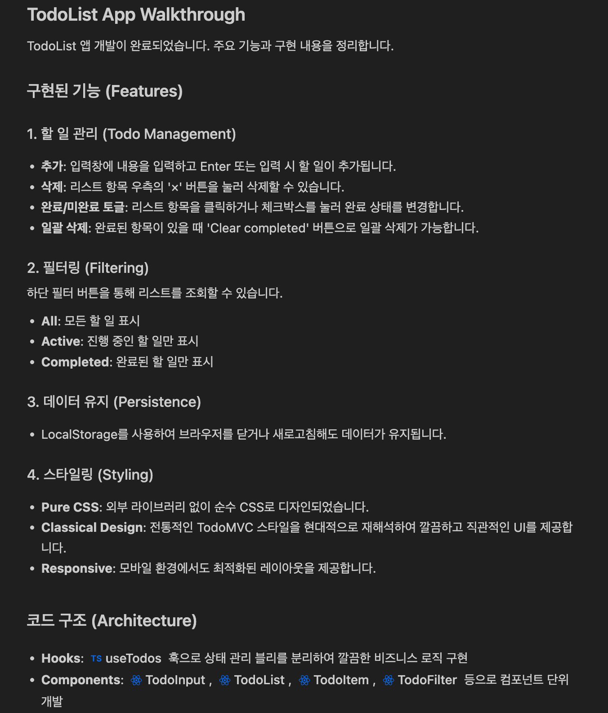

# 개발의 미래를 미리보다 - Google Antigravity 체험기 (Future of Dev)

"IDE가 아니라, 에이전트 운영체제(OS)다."

최근 혼자서 `Prompt Manager`라는 프로덕트를 바닥부터 개발하며(0 to 1), 가장 절실하게 느꼈던 갈증들이 있습니다. 그런데 놀랍게도, 그 갈증을 정확히 해소해주는 제품이 구글에서 발표되었습니다. 바로 **Antigravity**입니다.

최근 화제가 된 [요즘IT의 Antigravity 체험기](https://yozm.wishket.com/magazine/detail/3514/)를 읽으며, 제가 이 프로덕트를 만들며 했던 고민들이 어떻게 기술적으로 구현되었는지 소름 돋는 포인트 3가지를 정리해봤습니다.

---

## 1. Manager View: "코딩"에서 "지휘"로
혼자서 기획(PO), 디자인, 프론트엔드, 백엔드, 배포(DevOps)까지 다 하다 보면 가장 힘든 건 **'맥락 스위칭(Context Switching)'**입니다.
Backend 로직을 짜다가 갑자기 Frontend UI가 깨지면, 머릿속의 스택을 비우고 다시 채워야 하죠.

Antigravity의 **Manager View**는 이 문제를 해결합니다.
*   **Editor View**: 내가 직접 디테일한 코드를 짤 때 집중하는 공간.
*   **Manager View**: AI 에이전트에게 "회원가입 로직 짜줘", "UI 테스트 해줘"라고 위임하고, 전체 진행 상황을 관제하는 공간.

이제 개발자는 코드를 하나하나 타이핑하는 'Player'에서, 여러 에이전트를 조율하는 'Director'로 진화하게 됩니다.

## 2. Artifacts: "막연한 믿음"을 "확실한 시스템"으로
AI에게 개발을 맡길 때 가장 불안한 건 신뢰 문제입니다. "얘가 엉뚱한 파일을 건드려서 다 망가뜨리면 어쩌지?"
그래서 저는 개발 전에 항상 PRD(요구사항 정의서)와 구현 계획을 꼼꼼히 문서화하는 데 시간을 많이 썼습니다.

Antigravity는 이 과정을 **'Artifacts(산출물)'**라는 시스템으로 정착시켰습니다.
*   **Implementation Plan**: 코드를 건드리기 전에 **"어떻게 고칠지"** 계획서를 먼저 제출하고 승인받습니다.
*   **Verification Plan**: **"테스트는 어떻게 할지"** 미리 성공 조건을 정의합니다.

'계획(Plan) - 실행(Execute) - 검증(Verify)'의 루프가 시스템 안에서 자동으로 돌아가니, 개발자는 AI를 믿고 맡길 수 있게 됩니다.

## 3. Browser Control: "사용자 경험"이 진짜 테스트다
단위 테스트(Unit Test)가 다 통과해도, 실제 브라우저에서 버튼이 안 눌리면 그건 버그입니다.
특히 혼자 개발할 때는 모든 엣지 케이스를 직접 눌러보며 확인하기가 벅찹니다.

Antigravity의 에이전트는 실제로 **크롬 브라우저를 띄워서 클릭하고, 입력하고, 스크롤**합니다.
사람처럼 행동하며 전체 시나리오(E2E)를 검증하고, 그 과정을 녹화해서 보여줍니다.
"회원가입하고 인증 메일이 제대로 오는지 확인해줘"라는 명령이 가능해진 것입니다.

---

## 🚀 Coming Soon: Prompt Manager Beta
제가 Antigravity를 보며 감탄한 이유는, 저 역시 `Prompt Manager`를 만들며 **"단순한 도구가 아니라, 내 의도를 이해하고 먼저 제안하는 파트너"**를 만들고 싶었기 때문입니다.

지난 몇 주간의 치열한 개발 끝에, 드디어 **Prompt Manager**가 세상에 나갈 준비를 마쳤습니다.
AI 프롬프트를 더 체계적으로 관리하고, 최적의 모델을 추천받고, 팀원과 협업할 수 있는 경험.

🔜 **다음 주, Prompt Manager의 오픈 베타 테스트(Open Beta Test) 소식을 전해드리겠습니다.**
많은 관심 부탁드립니다!

#Antigravity #Google #Gemini #IDE #AgenticWorkflow #ProductBuilding #AI #PromptManager #BetaTest
