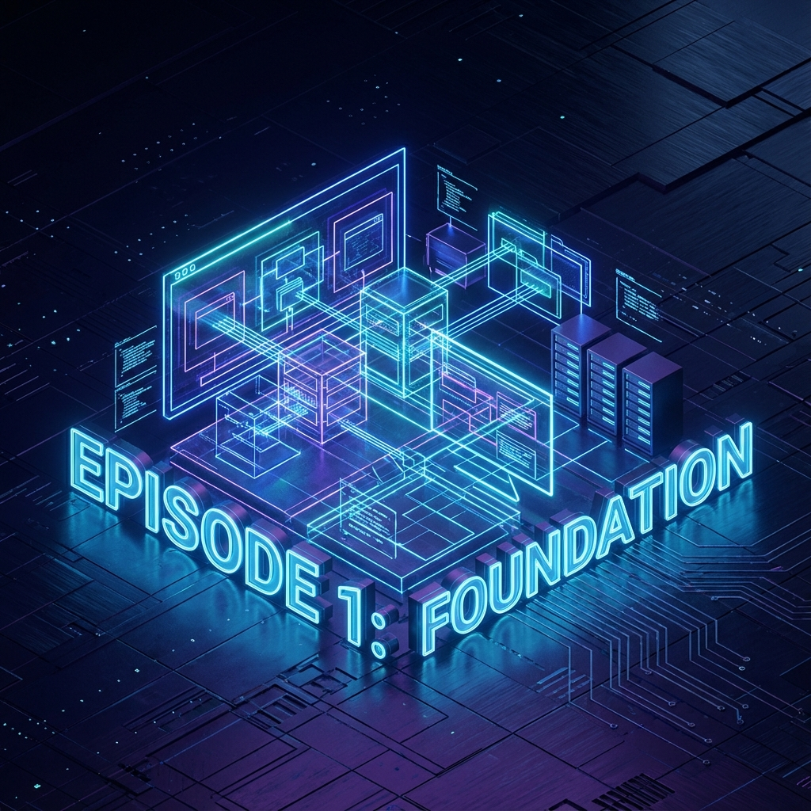

# Ep.01: 시작이 반이다 - Product Builder의 환경 설정과 설계 (The Setup)

"기획자가 코딩을 배우면 어디까지 만들 수 있을까?"
이 질문에 대한 답을 찾기 위해 3주간의 **Product Building** 여정을 시작했습니다. 

그 첫 번째 이야기는 **'어떻게 시작할 것인가'**에 대한 기록입니다.

---

## 🏗️ 1. 기획을 코드로 번역하는 힘: PRD (Product Requirements Document)
많은 분들이 아이디어가 생기면 IDE(통합개발환경)부터 켭니다. 하지만 저는 **Notion**을 먼저 켰습니다.
AI가 코딩을 도와주는 시대라지만, **'무엇을 만들 것인가'**를 명확히 정의하지 않으면 AI도 엉뚱한 결과물을 내놓습니다.

저는 다음과 같은 원칙으로 초기 PRD를 작성했습니다.
*   **Problem Definition**: "프롬프트 관리가 엑셀로는 불가능하다."
*   **User Persona**: AI 서비스를 만드는 PO, Prompt Engineer.
*   **Core Loop**: 작성(Draft) -> 평가(Evaluate) -> 최적화(Optimize).

이 PRD는 단순한 문서가 아니라, AI 코딩 에이전트에게 시킬 **'명확한 지시서(Prompt)'**가 되었습니다. Product Builder에게 PRD는 곧 설계도이자 무기입니다.

## ⚡ 2. Tech Stack: "Speed is the Feature"
혼자서 Frontend, Backend, Database, AI Worker까지 구축해야 합니다.
선택 기준은 단 하나, **'속도'**와 **'생산성'**이었습니다.

*   **Next.js 16 (App Router)**: 최신 React 기능과 빠른 성능.
*   **Tailwind CSS 4**: 스타일링의 고민을 줄이고 직관적인 UI 구현.
*   **Supabase**: 인증(Auth)과 DB를 5분 만에 세팅. Backend 코드를 줄여주는 일등공신.
*   **FastAPI (Python)**: AI 라이브러리(DSPy, OpenAI, Gemini)와의 호환성을 위해 Backend 로직은 Python으로 분리.

이 조합은 '풀스택 경험이 없는' 기획자도 빠르게 프로덕션 레벨의 앱을 찍어낼 수 있게 해주는 **Cheat Key**입니다.

## ✨ 3. 철학: "Vibe Coding"
개발 과정에서 가장 중요하게 여긴 원칙은 **'Vibe Coding'**입니다.
*   **State of Flow**: 끊김 없는 몰입. 에러가 나도 당황하지 않고 AI와 대화하며 풀어가는 과정.
*   **Aesthetics from Day 1**: "디자인은 나중에"가 아닙니다. 
    > _"The application should look beautiful and coherent."_ 
    
    첫 버튼 하나를 만들더라도 완성도 있는 UI를 고집했습니다. 예쁜 코드가 예쁜 제품을 만듭니다.

---

## 🔚 Next Episode...
환경은 갖춰졌습니다. 하지만 MVP를 배포하자마자 **'비용'**이라는 현실적인 벽에 부딪혔습니다.
다음 편에서는 OpenAI 비용 폭탄을 피하기 위해 **Google Gemini로 전체 AI 엔진을 교체**하고, 독자적인 최적화 파이프라인(**Project Crucible**)을 구축한 이야기를 다룹니다.

#ProductBuilder #0to1 #PRD #TechStack #NextJS #Supabase #VibeCoding #Insight
