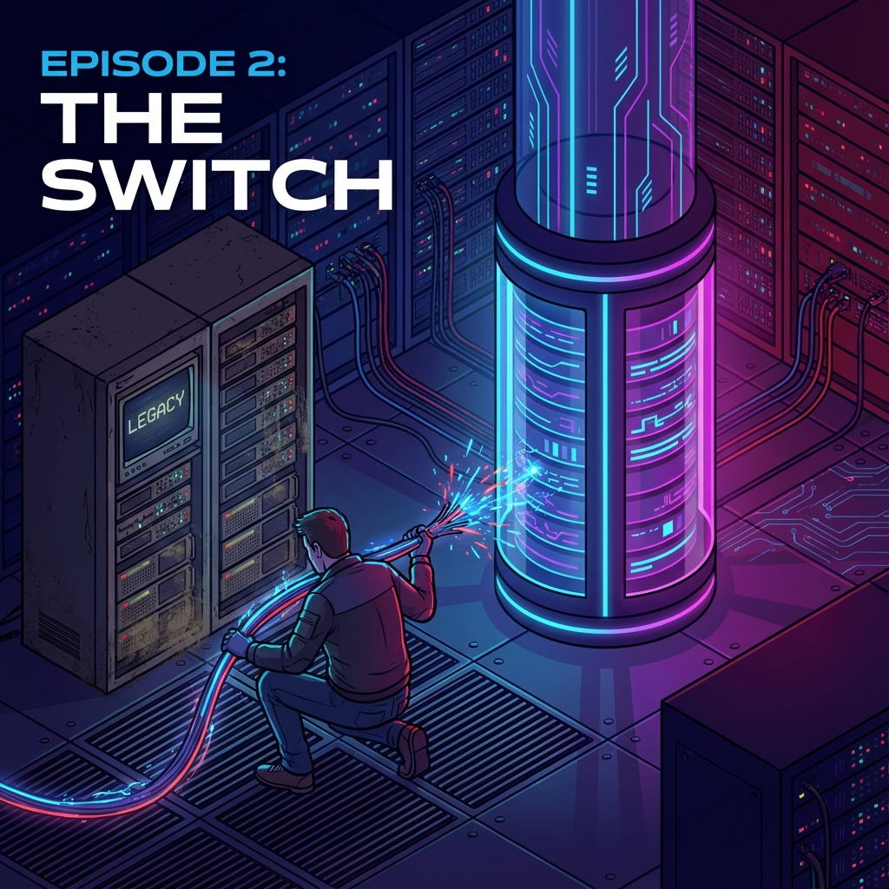

# Ep.02: 비용과 성능의 딜레마 - Project Crucible (The Pivot)



"MVP가 잘 돌아간다. 그런데 통장이 텅 비어간다."

토이 프로젝트라면 상관없지만, **Product Builder**라면 '수익성(Unit Economics)'을 무시할 수 없습니다. 
AI 프롬프트 최적화 기능을 배포하자마자 OpenAI API 비용이 기하급수적으로 늘어나는 문제를 직면했습니다.

두 번째 이야기는 이 문제를 해결하기 위한 **'Project Crucible'**의 기록입니다.

---

## 💸 1. The Problem: "Token is Money"
초기 모델은 OpenAI GPT-4o를 사용했습니다. 성능은 좋았지만, 프롬프트 최적화(Optimization) 과정에서 수만 개의 토큰이 소모되었습니다.

*   **Cost**: $0.15 / 1M tokens (당시 기준)
*   **Latency**: 평균 10초 이상의 긴 대기 시간.

"이대로면 사용자가 늘어날수록 적자다."

물론 AWS Free Tier나 Google Cloud Free Trial 크레딧으로 초기 비용을 방어할 수는 있습니다. 하지만 **'혜택이 끝난 뒤(Post-Free-Tier)'**에도 생존 가능한 비즈니스 모델인가?
Product Builder는 이 질문에 답해야 합니다. 
저는 크레딧이 만료된 후에도 감당 가능한 '진짜 Unit Economics'를 만들기 위해, 고비용의 SaaS(OpenAI)를 버리고 최적화된 아키텍처를 찾아야 했습니다.

PO로서의 저는 **'비용 절감'**을 최우선 목표로 잡고, Dev로서의 저는 **'기술적 마이그레이션'**을 결심했습니다.

## 🔄 2. The Pivot: OpenAI to Gemini
대안은 Google의 **Gemini 1.5 Flash**였습니다.
*   **Cost**: $0.075 / 1M tokens (약 50% 절감).
*   **Performance**: 압도적인 속도와 긴 Context Window.

하지만 문제가 있었습니다. 프롬프트 최적화 프레임워크인 **DSPy**의 내장 Google 모듈(LiteLLM 기반)이 당시 최신 모델인 **Gemini 1.5 Flash**와 호환성이 불안정(Flaky)했습니다.
표준 어댑터를 사용하면 `Authentication Error`가 발생하거나, 응답 포맷을 제대로 파싱하지 못하는 문제가 있었습니다. 단순히 API URL만 바꾼다고 해결될 문제가 아니었습니다.

## 🛠️ 3. Engineering: "없으면 만든다" (Custom Adapter)
저는 DSPy의 소스코드를 분석하고, Gemini API와 통신할 수 있는 커스텀 어댑터 **`GeminiLM`**을 직접 개발했습니다.

```python
class GeminiLM(dspy.LM):
    def __init__(self, model="gemini-1.5-flash", **kwargs):
        # Google Generative AI SDK와 DSPy 인터페이스 연결
        self.model = genai.GenerativeModel(model)
        ...
```

또한, 최적화 전략을 **MIPROv2 (Multi-prompt Instruction Proposal Optimizer)**로 고도화하여, 더 적은 시도(Few-shot)로 더 높은 품질의 프롬프트를 뽑아내도록 튜닝했습니다.

## 🚀 4. Result: The Gemini Factory
결과는 성공적이었습니다.
*   **Cost**: 비용 50% 절감 달성.
*   **UX**: Supabase Realtime을 연동하여, 관리자가 최적화 진행 상황을 실시간으로 모니터링하는 'Factory Dashboard' 구축.

비즈니스 문제를 기술로 해결하는 경험. 
이것이 **Product Builder**가 느낄 수 있는 가장 큰 짜릿함이 아닐까요?

---

## 🔚 Next Episode...
비용 문제는 잡았습니다. 이제 서비스가 안정궤도에 올랐다고 생각했죠.
하지만 어느 날 사용자에게서 연락이 왔습니다. 
**"회원가입 메일이 안 와요."**

다음 편에서는 로컬에서는 절대 발견할 수 없었던, **프로덕션 환경의 유령 'Silent Drop'**과 싸운 치열한 디버깅 로그를 공개합니다.

#Gemini #GoogleAI #Optimization #CostEfficiency #DSPy #Backend #Python #DevOps
