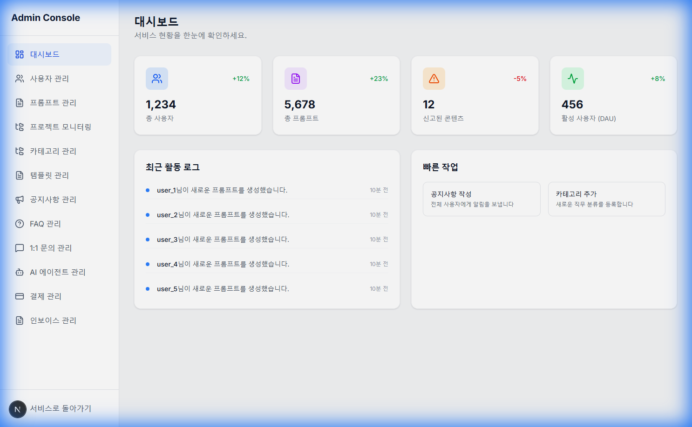
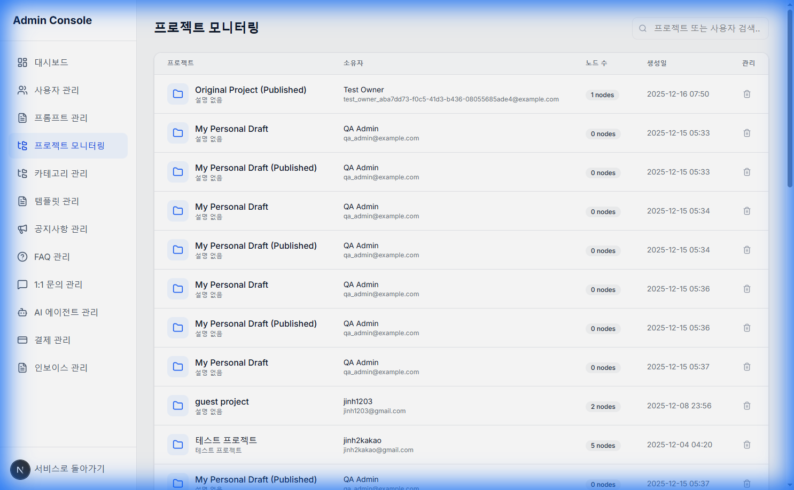

# Ep.03: "The Silent Drop" - 배포는 끝이 아니라 시작이다 (Reliability)

"로컬에서는 잘 되는데요?"
주니어 개발자가 가장 많이 하는 말입니다. 그리고 지난 주, 제가 가장 많이 되뇐 말이기도 합니다.

기능 개발이 끝나고 Production 환경에 배포했을 때, 예상치 못한 **'유령들'**이 튀어나왔습니다. 세 번째 이야기는 그 유령들을 잡는 **Troubleshooting** 과정입니다.

---

## 👻 1. The Silent Drop: 메일이 사라진다
회원가입 인증 메일이 오지 않는다는 리포트가 들어왔습니다. 로그를 확인해보니 `250 OK` 성공 응답이 찍혔습니다. 성공했는데 메일이 없다?

알고 보니 **Google SMTP**가 보안 정책상 특정 IP(클라우드 대역)에서의 발송을 조용히 차단(Silent Drop)하고 있었습니다.


*   **Initial Tactic**: 단순히 SMTP 포트를 바꾸거나 설정을 건드렸지만 해결되지 않았습니다.
*   **Strategic Pivot**: 기술적 한계와 싸우기보다 **우회로**를 택했습니다.

## 🛡️ 2. Strategy Pattern: 유연한 구조의 힘
메일 발송 로직을 **Strategy Pattern**으로 리팩토링했습니다.
```python
class EmailService(ABC):
    @abstractmethod
    def send_email(self, ...): pass

class SmtpEmailService(EmailService): ... # Legacy
class GmailApiService(EmailService): ... # New!
```
코드를 완전히 엎지 않고, `GmailService` 구현체만 갈아끼우는 방식으로 **Gmail API (OAuth 2.0)** 도입에 성공했습니다. 
덕분에 전송 성공률 100%, 지연 시간 2초 미만의 안정적인 시스템을 구축했습니다.

## 🔒 3. SSL & CORS: 보안의 벽
AWS EC2와 Cloudflare를 연동하는 과정에서 **Mixed Content** 에러와 **CORS** 지옥이 펼쳐졌습니다.
*   **Problem**: Frontend(HTTPS) -> Backend(HTTP) 요청 시 브라우저 차단.
*   **Solution**: 
    1.  **Full Strict SSL**: Cloudflare와 EC2 사이에 Origin Certificate을 설치해 End-to-End 암호화.
    2.  **Nginx Proxy**: Nginx가 SSL 인증과 Preflight(OPTIONS) 요청을 처리하고, 백엔드는 비즈니스 로직만 수행하도록 역할 분리.

## 💡 Insight: "It works on my machine"은 변명이다


사용자는 내 컴퓨터 환경을 쓰지 않습니다. 
**Product Builder**의 책임은 `localhost`가 아니라, 사용자의 화면에 결과가 뜰 때까지입니다.
이 과정에서 배운 **Ops(운영)** 능력은 그 어떤 코딩 문법보다 값진 자산이 되었습니다.

---

## 🔚 Next Episode...
이제 시스템은 튼튼해졌습니다(Reliable). 비용도 효율적입니다(Efficient).
하지만 아직 부족합니다. 사용자가 "와!" 할만한 **'한 방(Wow Factor)'**이 없으니까요.

마지막 편에서는 단순한 관리 도구를 **'AI 인텔리전트 파트너'**로 진화시킨 **Agent Recommendation** 기능 개발기를 공유합니다.

#DevOps #Troubleshooting #SystemArchitecture #Reliability #GmailAPI #AWS #Cloudflare #StrategyPattern
