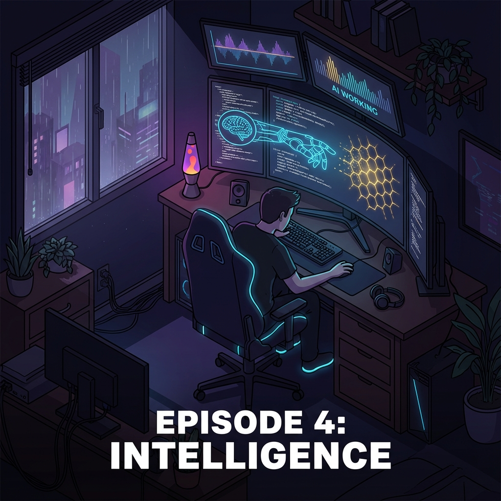
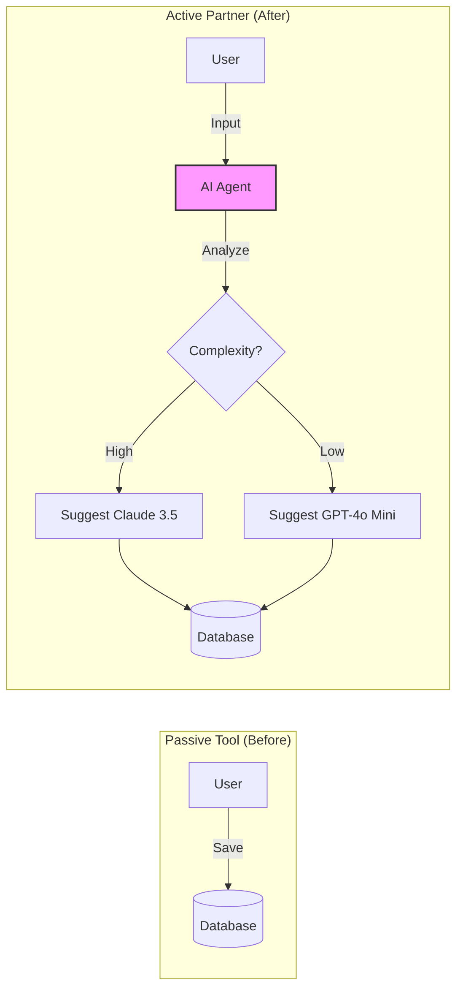
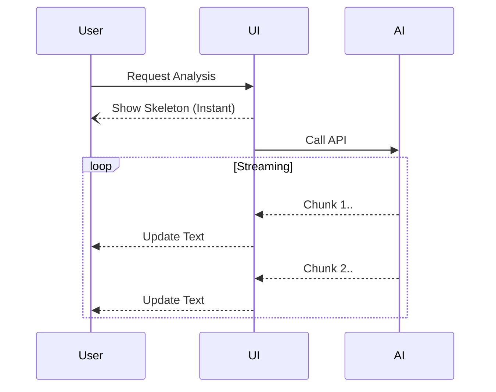

# Ep.04: 단순 도구를 넘어 지능형 파트너로 - AI Agent Recommendation (Intelligence)



"이 프롬프트는 GPT-4가 좋을까, Claude 3.5가 좋을까?"
프롬프트 엔지니어들이 가장 많이 하는 고민입니다.

네 번째 이야기는 단순히 프롬프트를 저장하는 도구(Store)에서, 사용자에게 최적의 AI 모델을 제안하는 **'지능형 파트너(Partner)'**로 진화시킨 과정입니다.

---

## 🧠 1. Beyond Tool: Active Intervention
기존의 프롬프트 관리 툴은 '수동적'이었습니다. 사용자가 입력한 대로 저장할 뿐이죠.
저는 시스템이 **'능동적으로 개입(Intervention)'**하길 원했습니다.

*   **Before**: 사용자가 알아서 모델 선택.
*   **After**: 시스템이 프롬프트의 복잡도와 의도를 분석해 **"이 작업에는 Claude 3.5 Sonnet이 적합합니다"**라고 제안.



이를 위해 **APEF (Automated Prompt Evaluation Framework)**를 고도화하여, 프롬프트의 논리적 구조를 파악하고 각 LLM의 특성(Reasoning vs Creative)과 매칭시키는 로직을 구현했습니다.

## ⚡ 2. UX: The Need for Speed
AI 분석은 시간이 걸립니다. 하지만 사용자는 기다려주지 않습니다.
여기서 **'체감 속도'**를 높이는 UX 트릭들을 적용했습니다.

*   **Skeleton UI**: 로딩 스피너 대신 뼈대 화면을 즉시 보여주어 "시스템이 반응했다"는 안정감 제공.
*   **Optimistic UI**: 서버 응답을 기다리지 않고 UI를 먼저 업데이트.
*   **Streaming**: 분석 결과를 JSON 통짜가 아닌, 읽기 편한 텍스트로 풀어내어(Prose) 실시간으로 보여줌.



기술적인 Latency를 줄이는 것도 중요하지만, **사용자의 인내심을 관리하는 것**이 더 중요합니다.

## 💎 3. Final Polish: "한국어 패치"
아무리 좋은 기능도 말이 안 통하면 무용지물입니다.
AI가 내뱉는 영어 피드백을, 내부 System Prompt(**'The Judge'**) 튜닝을 통해 **100% 자연스러운 한국어**로 출력되도록 강제했습니다.

```mermaid
graph TD
    Raw[Raw AI Output (English)] --> Filter{The Judge Prompts}
    Filter -->|Tone Check| Polished[Fluent Korean]
    Style Raw fill:#ccc
    Style Polished fill:#bbf,stroke:#333
```
사소해 보이지만, 이 '한 끗' 차이가 제품의 완성도를 결정합니다.

---

## 🔜 Final Episode...
3주간의 코딩 대장정이 끝났습니다.
환경 설정부터 배포, 그리고 고도화까지. 
마지막 편에서는 기획자(PO)가 직접 코드를 짜며 깨달은 **'Product Builder'로서의 3가지 핵심 인사이트**를 정리하며 시리즈를 마무리합니다.

#AI #LLM #UXDesign #Agent #Automation #ProductDesign #Frontend #NextJS
