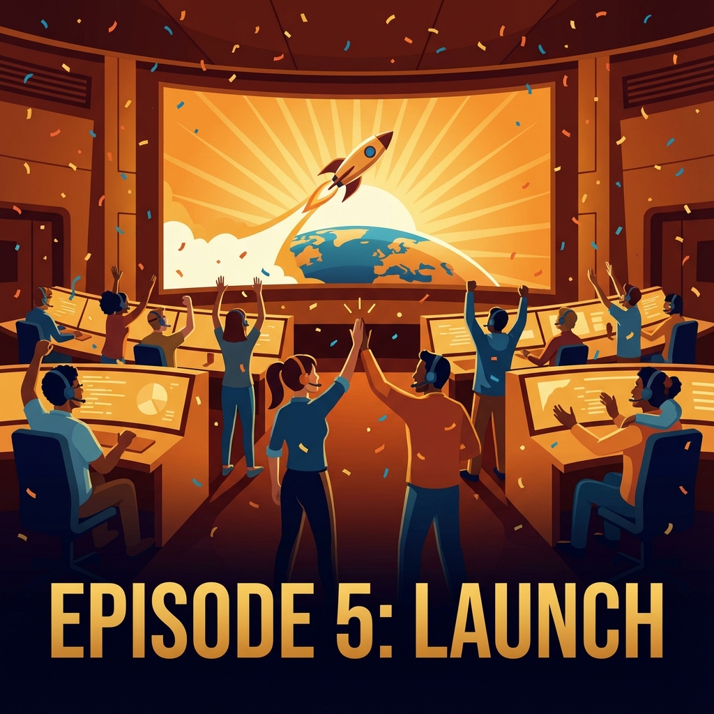
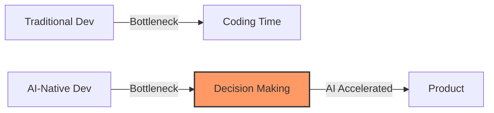
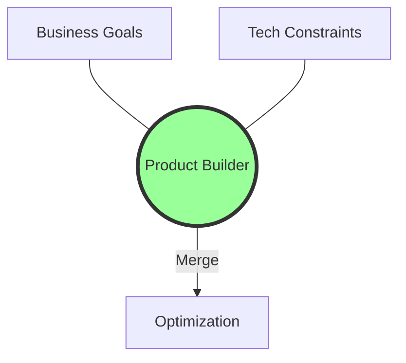
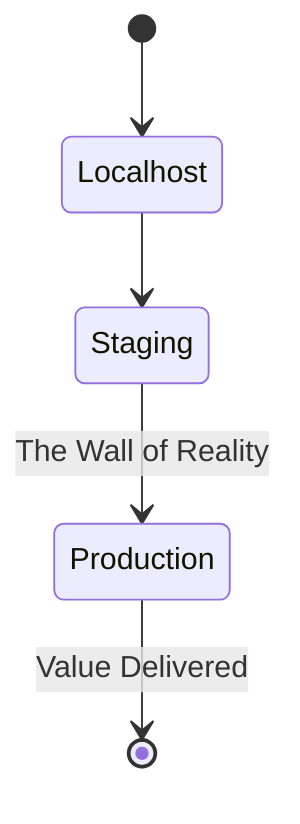

# Ep.05: Product Owner에서 Product Builder로 (Conclusion)

"기획은 코드를 몰라도 된다?"
"개발은 기획서대로만 하면 된다?"

지난 3주, `Prompt Manager`를 직접 만들며 이 두 가지 명제를 모두 깨부쉈습니다. 
마지막 이야기는 이 과정을 통해 얻은 **'Product Builder'**로서의 3가지 핵심 인사이트입니다.

---

## 🚀 1. Speed Definition is Changing
과거의 PO는 기획서를 쓰고, 디자이너와 개발자의 일정을 조율하며 시간을 보냈습니다.
하지만 AI 시대의 Product Builder는 **PRD를 쓰는 동시에 코드를 생성**합니다.
*   **Insight**: 이제 속도의 병목은 '코딩'이 아니라 **'의사결정(Decision Making)'**입니다. 무엇을 만들지 명확히 안다면, 만드는 건 AI가 도와줍니다. 기획자의 명확성이 곧 개발 속도입니다.

## 🌉 2. Break the Wall: Biz & Tech
비용 문제로 OpenAI에서 Gemini로 마이그레이션 했던 **Ep.02**를 기억하시나요?
만약 제가 코드를 모르는 PO였다면 "개발팀, 비용 좀 줄여보세요"라고 말만 했을 겁니다.
만약 제가 비즈니스를 모르는 Dev였다면 "성능 좋은데 왜 바꿔요?"라고 했을 겁니다.

**Product Builder**는 이 경계선 위에 서 있습니다. 
비즈니스 임팩트를 위해 기술 스택을 과감히 갈아엎을 수 있는 용기, 그것이 '진짜 최적화'를 만듭니다.

## 🛠️ 3. "Done" means "Deployed"
로컬에서 아무리 잘 돌아가도, 배포되지 않으면 가치가 0입니다.
**Ep.03**의 이메일 전송 실패 이슈처럼, 진짜 문제는 언제나 '현장(Production)'에 있습니다.
끝까지 책임지고 사용자 손에 쥐어주는 경험, 그것이 제품을 보는 눈을 완전히 바꿉니다.

---

## 🏁 Outro
이 시리즈를 통해 공유하고 싶었던 건 단순한 개발 튜토리얼이 아닙니다.
**"직접 만들 수 있는 힘(Agency)이 생겼을 때, 제품을 바라보는 시야가 얼마나 넓어지는가"**에 대한 이야기였습니다.

지금도 수많은 아이디어가 머릿속을 스쳐 지나가나요?
Notion을 켜고 PRD를 쓰세요. 그리고 IDE를 켜세요.
당신은 이미 준비된 **Product Builder**입니다.

#ProductBuilder #Conclusion #Insight #Growth #AI #ProductManagement #Leadership #VibeCoding
