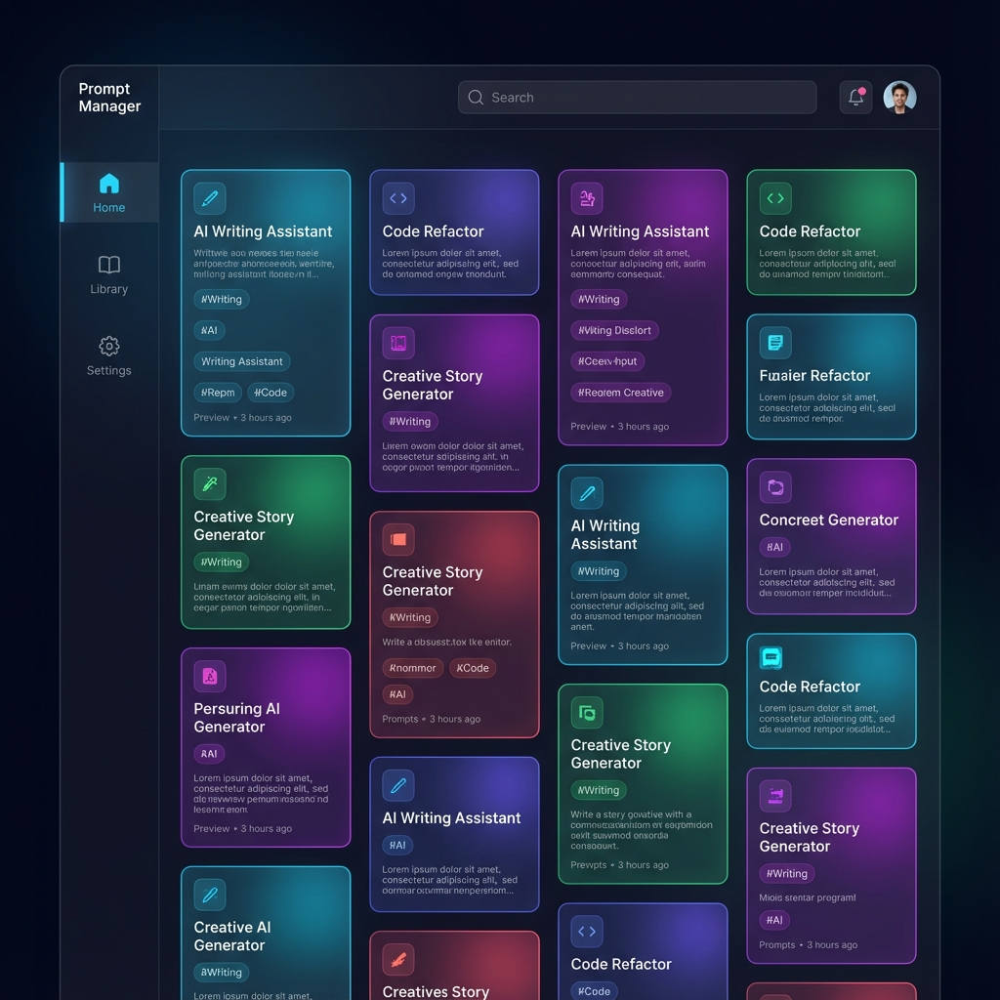
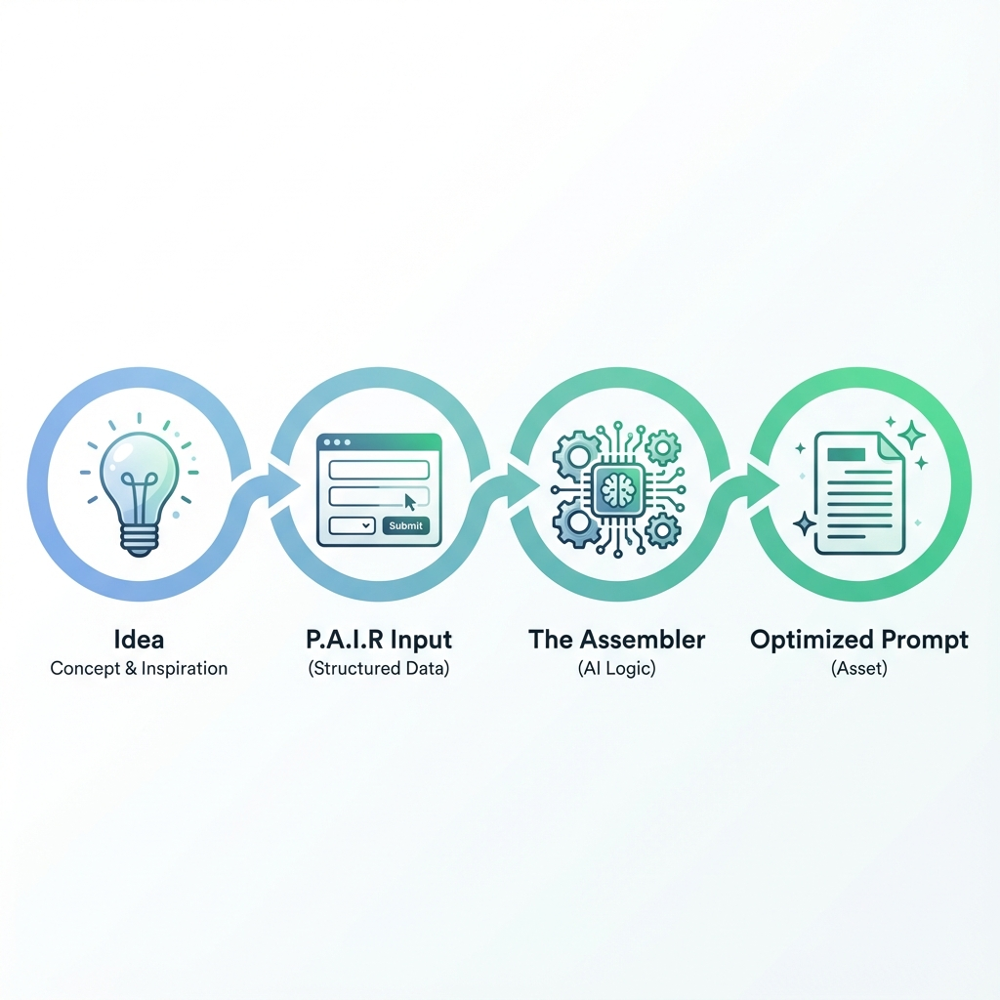
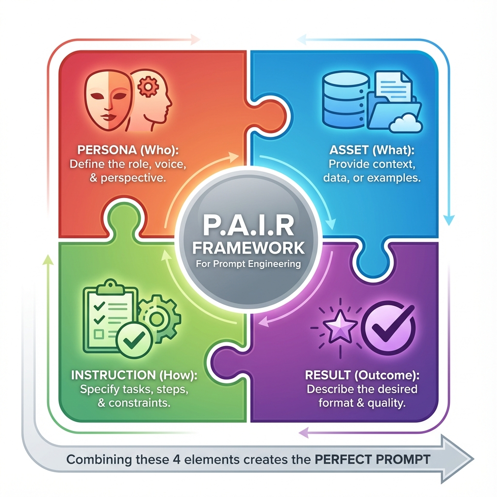
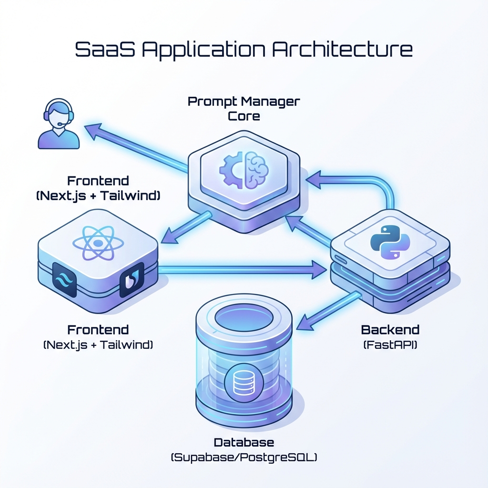

# Project: Prompt Manager (AI Native SaaS)

## 1. 프로젝트 개요 (Overview)
**"파편화된 프롬프트를 자산으로 전환하는 AI 네이티브 생산성 도구"**

*   **Role**: Product Manager / Full Stack Developer (기획, 디자인, 개발 전 과정 리딩)
*   **Type**: B2B/B2C SaaS (Software as a Service)
*   **Status**: MVP 출시 및 고도화 (v1.3.0)
*   **Core Value**:
    *   **자산화 (Assetization)**: 휘발되는 대화형 AI 프롬프트를 체계적으로 저장하고 관리.
    *   **구조화 (Structure)**: **P.A.I.R 프레임워크**를 통해 고품질 프롬프트 생성을 유도.
    *   **재사용성 (Reusability)**: 변수(Variable) 자동 감지를 통한 즉시 실행 환경 제공.

---

## 2. 문제 정의 (Problem Statement)
*   **Pain Point 1 (파편화)**: "좋은 프롬프트를 짰는데 어디에 저장했는지 기억이 안 난다."
*   **Pain Point 2 (비효율)**: "매번 ChatGPT에 같은 맥락을 설명하느라 시간을 낭비한다."
*   **Pain Point 3 (표준화 부재)**: "팀원들이 쓰는 프롬프트의 품질이 제각각이다."

---

## 3. 해결 솔루션 (Solution: 0 to 1 Journey)

### Phase 1: 핵심 가치 검증 (MVP v1.0 ~ v1.1)
**목표**: 프롬프트의 저장과 재사용성을 극대화하는 '도구'로서의 가치 증명.

*   **Hybrid Input System**:
    *   숙련자를 위한 **'일반 모드(Simple)'**와 초보자를 위한 **'어시스턴스 모드(Assistance)'** 이원화.
    *   **P.A.I.R 프레임워크 (Persona, Asset, Instruction, Result)**를 UI에 녹여내어, 사용자가 빈칸만 채우면 전문가 수준의 프롬프트가 완성되도록 설계.
    *   
*   **The Assembler (비즈니스 로직)**:
    *   입력된 P.A.I.R 데이터(JSON)를 LLM이 이해하기 쉬운 마크다운 포맷(Text)으로 자동 조립하는 백엔드 로직 구현.
*   **Pinterest Style UI**:
    *   텍스트 위주의 지루한 프롬프트를 **Masonry Grid Layout**으로 시각화하여 탐색의 즐거움 제공 (v1.1).

### Phase 2: 확장성 및 운영 체계 구축 (Admin v1.2)
**목표**: 서비스 운영 효율화 및 악성 콘텐츠 관리 체계 수립.

*   **Admin Console 구축**:
    *   사용자 등급 관리(Free/Pro) 및 CS 대응 기능.
    *   직무 카테고리(Category Tree)를 코딩 없이 수정할 수 있는 **동적 설정(Dynamic Configuration)** 기능 구현.
    *   악성 프롬프트 필터링 및 신고 처리 프로세스 정립.

### Phase 3: 사용자 경험 고도화 (Enhancement v1.3)
**목표**: 진입 장벽 제거 및 사용성 개선을 통한 리텐션 확보.

*   **Google Login (Social Auth)**:
    *   복잡한 가입 절차를 제거하고 '원클릭 가입' 도입. 신규 유저의 약관 동의 프로세스 최적화.
*   **Navigation Overhaul**:
    *   기존 상단 헤더 방식에서 **'좌측 사이드바(Sidebar)'** 구조로 변경하여 메뉴 확장성(마이페이지, 관리자 등) 확보.
*   **Multi-Template System**:
    *   직무별로 다양한 예시 템플릿을 제공하여 '어시스턴스 모드'의 활용도 증대.

---

## 4. 핵심 기능 디테일 (Key Features Deep Dive)

### 1) 프롬프트 런처 (The Prompt Launcher)
*   **기능**: 프롬프트 본문 내 `{{변수}}` 구문을 자동으로 파싱하여 입력 폼을 생성.
*   **UX 효과**: 사용자는 원본을 수정하지 않고도 변수값만 입력하여 즉시 완성된 프롬프트를 얻음 (복사/실행).
*   **Tech**: Regex 기반 파싱 로직 및 실시간 Preview 렌더링.

### 2) 반응형 디자인 전략 (Global Responsive Standard)
*   **전략**: 모든 페이지에 대해 Mobile, Tablet, Desktop 3단계 브레이크포인트 정의.
*   **구현**:
    *   **Desktop**: Split Screen (좌우 분할), Modal 팝업.
    *   **Mobile**: Stack Layout (상하 배치), Bottom Sheet 활용.
    *   터치 타겟(44px) 확보 및 폰트 스케일링 자동화.

### 3) 수익화 전략 (Monetization & Growth)
*   **Freemium Model**: Guest(10개) -> Free(50개) -> Pro(무제한) 단계별 유도.
*   **Upsell Trigger**: 무료 한도 초과 시점(11번째, 51번째)에 **'가격 비교 모달'**을 노출하여 결제 전환 유도.
*   **UI**: 연간 결제 시 할인율 강조 UI 설계.

---

## 5. 기술 스택 (Tech Stack)

### Frontend
*   **Framework**: **Next.js 16** (App Router) - 최신 React 기능을 활용한 서버 사이드 렌더링 및 정적 생성.
*   **Library**: **React 19** - 최신 훅과 동시성 기능 활용.
*   **Styling**: **Tailwind CSS 4** - 빌드 타임 최적화된 유틸리티 퍼스트 CSS.
*   **UI Components**: **Shadcn UI** (Radix UI 기반) - 접근성이 보장된 헤드리스 컴포넌트와 커스터마이징 가능한 디자인 시스템.
*   **State Management**: **Zustand** - 가볍고 직관적인 전역 상태 관리 (뷰 모드, 입력 폼 상태 등).
*   **Data Fetching**: **TanStack Query (React Query)** - 서버 상태 관리, 캐싱, 동기화.
*   **Animation**: **Framer Motion** - 부드러운 UI 전환 및 인터랙션 구현.

### Backend
*   **Framework**: **FastAPI** (Python) - 고성능 비동기 웹 프레임워크. P.A.I.R 로직 처리에 최적화.
*   **ORM**: **SQLModel** - Python 타입 힌트를 활용한 직관적인 데이터베이스 상호작용.
*   **Server**: Uvicorn (ASGI) / Gunicorn (Process Manager).

### Database & Infrastructure
*   **Database**: **Supabase (PostgreSQL)** - 관계형 데이터베이스의 안정성과 JSONB를 활용한 가변 템플릿 저장의 유연성 결합.
*   **Auth**: **Supabase Auth** (Google OAuth) - 안전하고 간편한 소셜 로그인 통합.
*   **Deployment**: Docker 컨테이너 기반 배포 환경.

---

## 6. 성과 및 배운 점 (Retrospective)
*   **성과**:
    *   복잡한 프롬프트 엔지니어링 개념(P.A.I.R)을 누구나 쓸 수 있는 UI(Form)로 추상화함.
    *   v1.0에서 v1.3까지 **점진적 배포(Iterative Deployment)**를 통해 제품 안정성 확보.
*   **Lesson Learned**:
    *   **"기능(Feature)보다 맥락(Context)이 중요하다."** -> 직무별 카테고리(v1.1)와 템플릿(v1.3)을 도입하게 된 배경.
    *   반응형 웹은 단순 CSS 수정이 아니라, 모바일 사용자의 행동 패턴(Thumb Zone)을 고려한 **UX 재설계**임을 체감.
