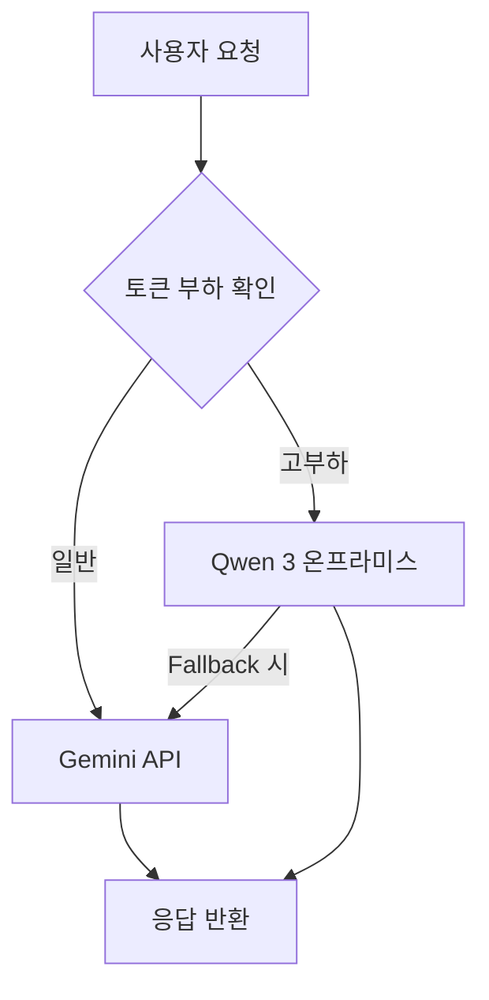
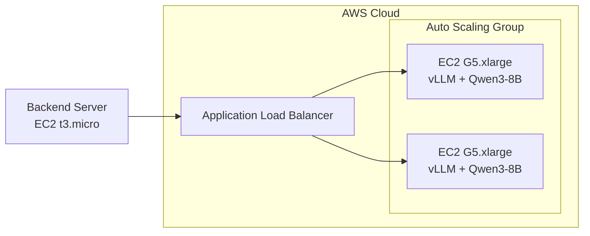
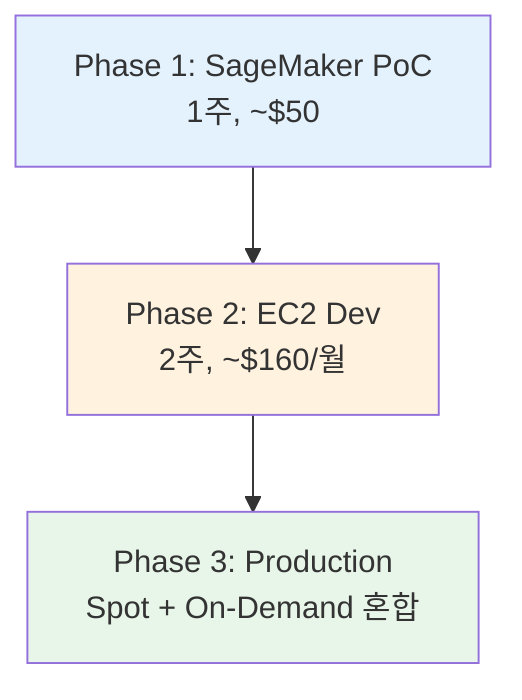
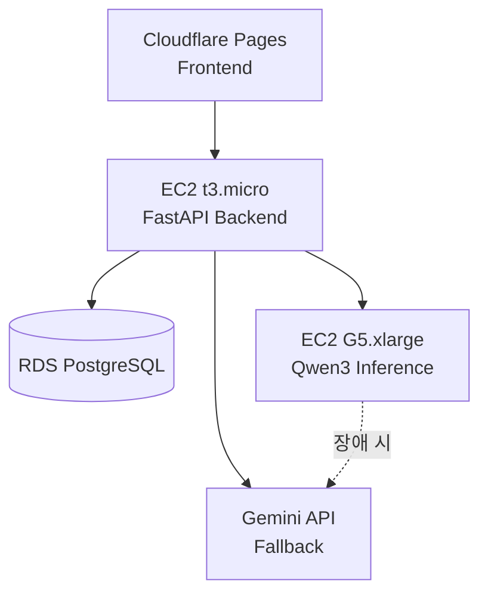
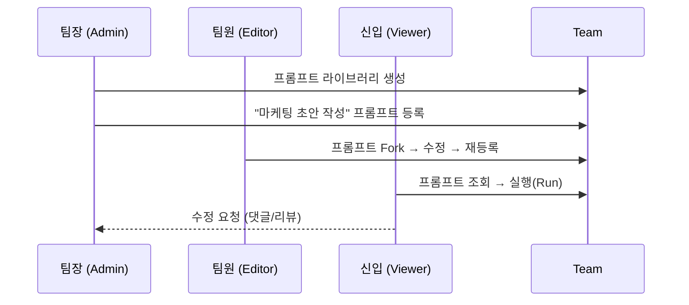
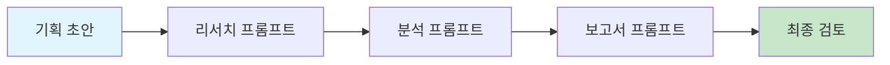
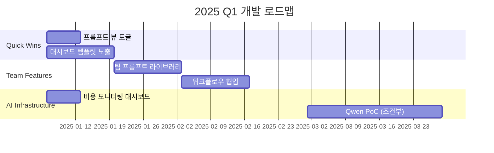

# 전략 회의 피드백 분석 보고서

**문서 정보**
- **날짜:** 2025-12-30
- **버전:** v1.0
- **작성자:** Antigravity Agent

---

## 📋 Executive Summary

본 보고서는 전략회의에서 도출된 4가지 핵심 피드백에 대한 분석 및 대응 방안을 정리한 문서입니다.

| 피드백 항목 | 우선순위 | 예상 공수 | ROI 평가 |
|------------|---------|----------|---------|
| Qwen 3 온프라미스 AI 도입 | 🔴 High Risk | 4-8주 | ⚠️ 중간 |
| 프롬프트 뷰 통합 (List/Kanban 토글) | 🟢 Low Risk | 1주 | ✅ 높음 |
| 대시보드 초기화면 (템플릿 노출) | 🟢 Low Risk | 1-2주 | ✅ 높음 |
| 팀 프로젝트 시나리오 개선 | 🟡 Medium | 3-4주 | ✅ 높음 |

---

## 1. Qwen 3 온프라미스 AI 도입

### 1.1 현황 분석

**현재 시스템:**
- **사용 모델:** Google Gemini 1.5 Flash
- **비용:** $0.075/1M tokens (Output)
- **구현 위치:** `backend/optimizer_worker/optimizer.py`
- **용도:** 프롬프트 최적화, APEF 평가

```python
# 현재 구현 (GeminiLM 커스텀 어댑터)
class GeminiLM(dspy.LM):
    def __init__(self, model_name="models/gemini-1.5-flash", api_key=None):
        ...
```

### 1.2 Qwen 3 도입 분석

#### 하드웨어 요구사항

| 모델 | 파라미터 | 필요 VRAM | 권장 GPU | 추정 비용 |
|------|---------|----------|---------|----------|
| Qwen3-8B | 8B | 16-24GB | RTX 4090 / L40s | GPU: $1,500-$5,000 |
| Qwen3-14B | 14B | 24-32GB | H100 (1x) | GPU: $30,000+ |
| Qwen3-32B | 32B | 48GB+ | A100/H100 | GPU: $15,000-$30,000 |
| Qwen3-30B-A3B (MoE) | 30B (3B active) | 16-24GB | RTX 4090 | GPU: $1,500-$2,000 |

> [!WARNING]
> **MoE 아키텍처 권장:** Qwen3-30B-A3B는 30B 모델이지만 추론 시 3B만 활성화되어 효율적. RTX 4090급으로 구동 가능.

#### 비용 비교 분석

| 항목 | Gemini API (현재) | Qwen 3 온프라미스 |
|------|------------------|------------------|
| **월간 1M 토큰 기준** | ~$0.08 | $0 (전기료 제외) |
| **월간 100M 토큰 기준** | ~$8 | $50-100 (전기료) |
| **초기 투자** | $0 | $5,000-$30,000 (GPU) |
| **운영 인력** | 불필요 | MLOps 인력 필요 |
| **SLA** | 99.9% | 자체 관리 |
| **손익분기점** | - | 월 500M+ 토큰 시점 |

#### 기술적 요구사항

```yaml
# 최소 사양 (Qwen3-8B 4-bit 기준)
Software:
  - Python 3.8+
  - PyTorch 2.0+
  - CUDA 11.4+
  - vLLM (추론 서버)
  
Hardware:
  - RAM: 32GB+
  - VRAM: 16GB+ (4-bit quantization)
  - Storage: 50GB SSD
  - GPU: NVIDIA RTX 4090 / L40s / A100
```

### 1.3 대응 전략

> [!IMPORTANT]
> **권장 전략: Hybrid Approach (단계적 도입)**

#### Phase 1: API 유지 + 비용 모니터링 (즉시)
- 현재 Gemini API 유지
- 월간 토큰 사용량 및 비용 메트릭 대시보드 구축
- 손익분기점 도달 시 Phase 2 트리거

#### Phase 2: PoC 환경 구축 (조건부)
- 월간 사용량 500M 토큰 초과 시 시작
- 소규모 GPU 서버(RTX 4090)로 Qwen3-8B 테스트
- A/B 테스트로 품질 비교

#### Phase 3: 프로덕션 마이그레이션 (검증 후)
- 품질 검증 완료 후 점진적 이관
- Fallback으로 Gemini API 유지

### 1.4 구현 방안



**코드 변경 포인트:**
- `backend/optimizer_worker/optimizer.py`: Qwen LM 어댑터 추가
- `backend/core/config.py`: AI 모델 라우팅 설정 추가
- 신규 파일: `backend/services/ai/qwen_adapter.py`

### 1.5 리스크 및 권장사항

| 리스크 | 영향도 | 완화 전략 |
|--------|-------|----------|
| GPU 장애 | 높음 | Gemini API fallback 유지 |
| 품질 저하 | 높음 | A/B 테스트 필수 |
| 운영 부담 | 중간 | 모니터링 자동화 |
| 초기 비용 | 중간 | 클라우드 GPU 렌탈 선 검토 |

> [!CAUTION]
> **즉시 도입은 비권장.** 현재 사용량 대비 투자 비용이 과도함. 월간 500M+ 토큰 사용량 도달 시점에 재검토 권장.

### 1.6 AWS 배포 옵션 (클라우드 GPU)

온프라미스 GPU 구매 대신 AWS 클라우드 GPU를 활용하는 방안입니다.

#### AWS 인프라 옵션 비교

| 옵션 | 서비스 | GPU | 시간당 비용 | 월간 비용 (24/7) | 적합 사용량 |
|------|--------|-----|------------|-----------------|------------|
| **A. SageMaker JumpStart** | Managed | G5.xlarge (A10G) | ~$1.41 | ~$1,015 | 빠른 배포, 관리형 |
| **B. EC2 G5.xlarge** | Self-Managed | A10G 24GB | ~$1.01 | ~$727 | Qwen3-8B (4-bit) |
| **C. EC2 G5.2xlarge** | Self-Managed | A10G 24GB | ~$1.21 | ~$871 | Qwen3-14B (4-bit) |
| **D. EC2 P4d.24xlarge** | Self-Managed | A100 x8 | ~$32.77 | ~$23,594 | Qwen3-72B+ |

> [!NOTE]
> **권장: EC2 G5.xlarge + Spot Instance** - 70% 비용 절감 가능 (시간당 ~$0.30)

#### Option A: SageMaker JumpStart (관리형)

**장점:**
- ✅ Qwen 3 모델 JumpStart에서 직접 배포 가능
- ✅ 인프라 관리 불필요
- ✅ Auto-scaling 지원
- ✅ 빠른 PoC 구축 (~1일)

**단점:**
- ❌ EC2 대비 ~40% 비용 증가
- ❌ 커스터마이징 제한

**배포 코드:**
```python
from sagemaker.jumpstart.model import JumpStartModel

model = JumpStartModel(
    model_id="huggingface-llm-qwen2-5-7b-instruct",
    instance_type="ml.g5.xlarge"
)
predictor = model.deploy()
```

#### Option B: EC2 Self-Managed (권장)

**장점:**
- ✅ 비용 효율적 (Spot Instance 활용 시 더욱)
- ✅ 완전한 커스터마이징
- ✅ 기존 AWS 인프라(EC2)와 동일 관리 체계

**단점:**
- ❌ vLLM/TGI 직접 설정 필요
- ❌ 모니터링/스케일링 직접 구축

**아키텍처:**


**배포 스크립트 예시:**
```bash
# EC2 G5.xlarge에서 vLLM으로 Qwen3-8B 서빙
docker run --gpus all -p 8000:8000 \
  vllm/vllm-openai:latest \
  --model Qwen/Qwen2.5-7B-Instruct \
  --quantization awq \
  --max-model-len 8192
```

#### AWS 비용 시뮬레이션

| 시나리오 | 인스턴스 | 사용 시간 | 월간 비용 | vs Gemini API |
|---------|---------|----------|----------|---------------|
| **PoC (테스트)** | G5.xlarge Spot | 40시간/월 | ~$12 | +$4 |
| **개발 환경** | G5.xlarge On-Demand | 160시간/월 | ~$162 | +$154 |
| **프로덕션 (24/7)** | G5.xlarge On-Demand | 720시간/월 | ~$727 | +$719 |
| **프로덕션 (Spot)** | G5.xlarge Spot | 720시간/월 | ~$220 | +$212 |

> [!TIP]
> **손익분기점 계산:** 월 $727 ÷ $0.075/1M = **~9.7B 토큰/월** 사용 시 EC2가 유리

#### AWS 배포 Phase 제안



| Phase | 목표 | 예상 비용 | 기간 |
|-------|------|----------|------|
| **Phase 1** | SageMaker로 품질 검증 | ~$50 | 1주 |
| **Phase 2** | EC2 + vLLM 환경 구축 | ~$160/월 | 2주 |
| **Phase 3** | Spot Instance 최적화 | ~$220/월 | 지속 |

#### Phase 3 상세: Spot + On-Demand 혼합 전략

**Spot vs On-Demand 비교:**

| 항목 | On-Demand | Spot Instance |
|------|-----------|---------------|
| **비용** | $1.01/시간 | ~$0.30/시간 (**70% 절감**) |
| **안정성** | ✅ 항상 보장 | ⚠️ 2분 전 통보 후 회수 가능 |
| **용도** | 미션 크리티컬 | 유연한 워크로드 |

**혼합 아키텍처:**
```
┌─────────────────────────────────────────────────────────┐
│                 Application Load Balancer               │
└────────────────────────┬────────────────────────────────┘
                         │
        ┌────────────────┼────────────────┐
        ▼                ▼                ▼
┌───────────────┐ ┌───────────────┐ ┌───────────────┐
│ On-Demand (1) │ │   Spot (1)    │ │   Spot (2)    │
│ 기본 용량 보장 │ │ 비용 절감     │ │ 비용 절감     │
│ 항상 유지     │ │ 회수 시 대체  │ │ 회수 시 대체  │
└───────────────┘ └───────────────┘ └───────────────┘
```

**권장 구성 비율:**

| 시나리오 | On-Demand | Spot | 월간 비용 | 절감율 |
|---------|----------|------|----------|--------|
| 보수적 | 50% | 50% | ~$470 | 35% |
| **균형 (권장)** | 30% | 70% | ~$370 | 49% |
| 공격적 | 20% | 80% | ~$320 | 56% |

**Auto Scaling 설정:**
```yaml
MixedInstancesPolicy:
  InstancesDistribution:
    OnDemandBaseCapacity: 1          # 최소 1개 On-Demand 보장
    OnDemandPercentageAboveBaseCapacity: 20
    SpotAllocationStrategy: "capacity-optimized"
  LaunchTemplate:
    Overrides:
      - InstanceType: g5.xlarge
      - InstanceType: g5.2xlarge  # Spot 부족 시 대체
```

**Spot 중단 대응:**
1. AWS가 2분 전 통보 → Graceful Shutdown
2. ALB가 On-Demand로 트래픽 전환
3. Auto Scaling이 새 Spot 인스턴스 요청

#### 기존 인프라 연동

현재 프로젝트 인프라:
- **Backend:** AWS EC2 t3.micro
- **Database:** AWS RDS PostgreSQL
- **Frontend:** Cloudflare Pages

**연동 아키텍처:**


**코드 통합 포인트:**
```python
# backend/services/ai/inference_router.py
class InferenceRouter:
    def __init__(self):
        self.qwen_endpoint = os.getenv("QWEN_ENDPOINT")  # EC2 ALB URL
        self.gemini_client = GeminiLM()
    
    async def optimize(self, prompt: str) -> str:
        if self.qwen_endpoint and self._is_healthy():
            return await self._call_qwen(prompt)
        return self.gemini_client(prompt)
```

### 1.7 AWS Free Tier 검토

> [!CAUTION]
> **결론: AWS Free Tier에서 Qwen 3 운영 불가능**

AWS Free Tier는 **GPU 인스턴스를 제공하지 않습니다.** t2.micro/t3.micro는 CPU 전용이며 LLM 추론에 필요한 연산 능력이 없습니다.

#### 대안 방안 비교

| 방안 | 비용 | 가능 여부 | 비고 |
|------|------|----------|------|
| **AWS Free Tier (t2/t3.micro)** | $0 | ❌ | GPU 없음, 메모리 부족 |
| **AWS Bedrock API** | 사용량 기반 | ⚠️ | Qwen 미지원 |
| **외부 무료 API** | $0~저렴 | ✅ 권장 | Groq, Together.ai |
| **Google Colab Pro** | $10/월 | ✅ | T4 GPU 16GB |

#### 권장 대안: 외부 API 활용

| 서비스 | Qwen 지원 | 무료 크레딧 | 가격 (/1M tokens) |
|--------|----------|------------|-------------------|
| **Groq** | ✅ | 무료 티어 | ~$0.05 |
| **Together.ai** | ✅ | $25 | ~$0.20 |
| **Fireworks.ai** | ✅ | 무료 티어 | ~$0.20 |

**구현 예시 (OpenAI 호환):**
```python
import openai

client = openai.OpenAI(
    api_key="TOGETHER_API_KEY",
    base_url="https://api.together.xyz/v1"
)

response = client.chat.completions.create(
    model="Qwen/Qwen2.5-7B-Instruct-Turbo",
    messages=[{"role": "user", "content": "Optimize this prompt..."}]
)
```

> [!TIP]
> **현실적 권장:** 현재 Gemini API 유지가 가장 비용 효율적. Qwen 전환은 사용량 증가 시 재검토.

---

## 2. 프롬프트 리스트 뷰 통합 (List/Kanban 토글)

### 2.1 현황 분석

**현재 구현:**
- 프롬프트 목록은 List View와 Kanban 뷰가 개별 구현
- `PromptCard` 컴포넌트가 v2.1.0에서 통합됨 (CHANGELOG 참조)
- 사용자는 명시적인 토글 UI 없이 고정된 뷰 사용

**관련 파일:**
- `frontend/src/features/prompts/PromptListContainer.tsx`
- `frontend/src/components/ui-generated/PromptList.tsx`

### 2.2 대응 전략

> [!TIP]
> **권장: 토글 버튼 방식 도입**

#### 디자인 방향

```
┌────────────────────────────────────────────────┐
│ My Prompts                    [📋 List] [🗂️ Kanban] │
├────────────────────────────────────────────────┤
│                                                │
│   (현재 선택된 뷰에 따른 콘텐츠)               │
│                                                │
└────────────────────────────────────────────────┘
```

### 2.3 구현 방안

#### 변경 범위

| 파일 | 변경 유형 | 설명 |
|------|----------|------|
| `PromptListContainer.tsx` | MODIFY | 뷰 상태 관리, 토글 UI 추가 |
| `stores/uiStore.ts` | MODIFY | listViewMode 상태 추가 |
| 신규: `ViewToggle.tsx` | NEW | 토글 버튼 컴포넌트 |

#### 상태 관리

```typescript
// stores/uiStore.ts
interface UIState {
  promptListView: 'list' | 'kanban';
  setPromptListView: (view: 'list' | 'kanban') => void;
}
```

#### 핵심 구현

```tsx
// 토글 버튼 컴포넌트
export function ViewToggle({ view, onChange }: ViewToggleProps) {
  return (
    <div className="flex gap-1 bg-gray-100 rounded-lg p-1">
      <button 
        className={cn(view === 'list' && 'bg-white shadow')}
        onClick={() => onChange('list')}
      >
        <ListIcon className="w-4 h-4" />
      </button>
      <button 
        className={cn(view === 'kanban' && 'bg-white shadow')}
        onClick={() => onChange('kanban')}
      >
        <KanbanIcon className="w-4 h-4" />
      </button>
    </div>
  );
}
```

### 2.4 예상 공수

| 작업 | 예상 시간 |
|------|----------|
| UI 컴포넌트 개발 | 4시간 |
| 상태 관리 통합 | 2시간 |
| localStorage 지속성 | 1시간 |
| QA 및 테스트 | 4시간 |
| **합계** | **~2일** |

---

## 3. 대시보드 초기화면 개선 (템플릿 노출)

### 3.1 현황 분석

**현재 상태:**
- 초기 화면은 "My Prompts" 리스트 (빈 상태 또는 사용자 프롬프트)
- 템플릿은 프롬프트 생성 시에만 접근 가능
- Guest/신규 사용자에게 즉각적인 가치 전달 제한

**관련 API:**
- `GET /api/templates` - 템플릿 목록 조회
- 현재 54개 Simple + 180개 Assistance 템플릿 보유

### 3.2 대응 전략

> [!TIP]
> **권장: 조건부 대시보드 렌더링**

#### 화면 구성안

```
┌─────────────────────────────────────────────────────┐
│ Welcome, [User Name]! 👋                            │
├─────────────────────────────────────────────────────┤
│ 📌 최근 사용한 템플릿 (로그인 사용자만 노출)         │
│ ┌─────┐ ┌─────┐ ┌─────┐ ┌─────┐                     │
│ │ T1  │ │ T2  │ │ T3  │ │ T4  │  → (최대 4개)       │
│ └─────┘ └─────┘ └─────┘ └─────┘                     │
├─────────────────────────────────────────────────────┤
│ 🔥 인기 템플릿                                      │
│ ┌─────┐ ┌─────┐ ┌─────┐ ┌─────┐ ┌─────┐ ┌─────┐     │
│ │ P1  │ │ P2  │ │ P3  │ │ P4  │ │ P5  │ │ P6  │     │
│ └─────┘ └─────┘ └─────┘ └─────┘ └─────┘ └─────┘     │
├─────────────────────────────────────────────────────┤
│ 📂 카테고리별 템플릿                                │
│ [개발] [디자인] [마케팅] [비즈니스] [데이터]         │
└─────────────────────────────────────────────────────┘
```

### 3.3 구현 방안

#### 데이터 모델 확장

```sql
-- 템플릿 사용 이력 추적
CREATE TABLE template_usage (
  id UUID PRIMARY KEY DEFAULT uuid_generate_v4(),
  user_id UUID REFERENCES users(id),
  template_id UUID REFERENCES prompt_templates(id),
  used_at TIMESTAMPTZ DEFAULT NOW()
);

-- 인기 템플릿 집계용 인덱스
CREATE INDEX idx_template_usage_count ON template_usage(template_id);
```

#### API 확장

| 엔드포인트 | 메서드 | 설명 |
|-----------|--------|------|
| `/api/templates/popular` | GET | 인기 템플릿 Top 10 |
| `/api/templates/recent` | GET | 사용자별 최근 사용 템플릿 |
| `/api/templates/{id}/use` | POST | 템플릿 사용 기록 |

#### 변경 파일

| 파일 | 변경 유형 |
|------|----------|
| `frontend/src/app/page.tsx` | MODIFY - 대시보드 레이아웃 |
| `backend/routers/templates.py` | MODIFY - API 추가 |
| `backend/models.py` | MODIFY - TemplateUsage 모델 |
| 신규: `DashboardTemplates.tsx` | NEW - 템플릿 섹션 컴포넌트 |

### 3.4 예상 공수

| 작업 | 예상 시간 |
|------|----------|
| DB 스키마 확장 | 2시간 |
| Backend API 구현 | 4시간 |
| Frontend 컴포넌트 | 8시간 |
| 스타일링 및 애니메이션 | 4시간 |
| QA | 4시간 |
| **합계** | **~3-4일** |

---

## 4. 팀 프로젝트 유저 시나리오 개선

### 4.1 현황 분석

**현재 팀 기능 (PRD v3.0.0):**
- 팀 생성 (Enterprise 전용)
- 멤버 관리 (초대/역할 변경/제거)
- 프로젝트 잠금 (Soft Locking)
- 퍼블리싱 워크플로우

**기존 API 엔드포인트:**
| Endpoint | 기능 |
|----------|------|
| `POST /api/teams` | 팀 생성 |
| `GET /api/teams` | 팀 목록 조회 |
| `POST /api/teams/{id}/members` | 멤버 초대 |
| `PUT /api/teams/{id}/members/{userId}` | 역할 변경 |
| `DELETE /api/teams/{id}/members/{userId}` | 멤버 제거 |

### 4.2 신규 유저 시나리오 제안

#### 시나리오 1: 팀 프롬프트 라이브러리

> "마케팅 팀이 검증된 프롬프트를 공유하고 재사용"



**필요 기능:**
- [ ] 팀 프롬프트 라이브러리 UI
- [ ] 프롬프트 실행(Run) 버튼 추가
- [ ] 프롬프트 코멘트/리뷰 시스템

---

#### 시나리오 2: 워크플로우 협업

> "기획팀이 프로젝트 캔버스에서 워크플로우 설계"



**필요 기능:**
- [ ] 프로젝트 단위 팀 공유
- [ ] 노드별 담당자 할당 (Assignee)
- [ ] 상태 관리 (Draft/In Review/Approved)

---

#### 시나리오 3: 온보딩 자동화

> "신입 사원에게 팀 표준 프롬프트 자동 배포"

**필요 기능:**
- [ ] 역할별 기본 프롬프트 세트
- [ ] 신규 멤버 초대 시 자동 배포
- [ ] 권장 템플릿 알림

---

### 4.3 구현 우선순위

| 기능 | 우선순위 | 가치 | 복잡도 |
|------|---------|------|--------|
| 팀 프롬프트 라이브러리 | P1 | 높음 | 중간 |
| 프롬프트 실행(Run) 버튼 | P1 | 높음 | 낮음 |
| 노드 담당자 할당 | P2 | 중간 | 중간 |
| 프롬프트 코멘트 시스템 | P2 | 중간 | 높음 |
| 온보딩 자동화 | P3 | 낮음 | 높음 |

### 4.4 구현 방안

#### Phase 1: 팀 프롬프트 라이브러리 (P1)

**데이터 모델:**
```sql
-- 기존 prompts 테이블 확장
ALTER TABLE prompts ADD COLUMN team_id UUID REFERENCES teams(id);

-- 팀 프롬프트 뷰
CREATE VIEW team_prompts_view AS
SELECT p.*, u.email as author_email, u.username as author_name
FROM prompts p
JOIN users u ON p.user_id = u.id
WHERE p.team_id IS NOT NULL;
```

**API 추가:**
| 엔드포인트 | 설명 |
|-----------|------|
| `GET /api/teams/{id}/prompts` | 팀 프롬프트 목록 |
| `POST /api/teams/{id}/prompts` | 팀에 프롬프트 등록 |
| `POST /api/prompts/{id}/publish` | 개인→팀 퍼블리싱 |

**Frontend 변경:**
- 팀 워크스페이스 전환 UI 추가
- 사이드바에 "Team Prompts" 메뉴 추가
- "Publish to Team" 버튼 추가

#### Phase 2: 워크플로우 협업 (P2)

**데이터 모델:**
```sql
-- 노드 담당자
ALTER TABLE project_nodes ADD COLUMN assignee_id UUID REFERENCES users(id);
ALTER TABLE project_nodes ADD COLUMN status TEXT DEFAULT 'draft' 
  CHECK (status IN ('draft', 'in_review', 'approved'));
```

### 4.5 예상 공수

| Phase | 작업 | 예상 시간 |
|-------|------|----------|
| P1 | 팀 프롬프트 라이브러리 | 2주 |
| P2 | 워크플로우 협업 | 2주 |
| P3 | 온보딩 자동화 | 1주 |
| **합계** | | **~5주** |

---

## 📊 종합 로드맵 제안



---

## ✅ 권장 Action Items

### 즉시 실행 (1-2주)
- [ ] 프롬프트 뷰 토글 UI 구현
- [ ] AI 비용 모니터링 메트릭 추가

### 단기 (3-4주)
- [ ] 대시보드 템플릿 섹션 구현
- [ ] 팀 프롬프트 라이브러리 MVP

### 중기 (2-3개월)
- [ ] 팀 워크플로우 협업 기능
- [ ] Qwen 3 PoC 환경 구축 (사용량 기준 충족 시)

---

## 📎 참고 자료

- [PRD v3.0.0 Team Cowork](file:///c:/Develops/techs/Ainativepromptmanagermvp/docs/prd/v3.0.0/PRD_v3.0.0_Team_cowork.md)
- [CHANGELOG](file:///c:/Develops/techs/Ainativepromptmanagermvp/CHANGELOG.md)
- [optimizer.py](file:///c:/Develops/techs/Ainativepromptmanagermvp/backend/optimizer_worker/optimizer.py)
- [teams.py](file:///c:/Develops/techs/Ainativepromptmanagermvp/backend/routers/teams.py)
